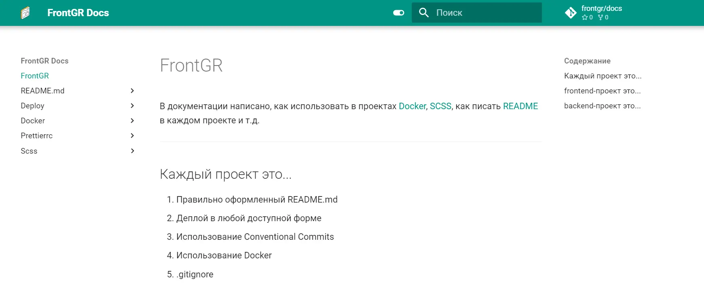

# docs

Detailed documentation for the frontgr codebase and organization of repositories and projects. Deploy you can check [here](https://frontgr.github.io/docs/).

## Preview of the project

---

### Technologies Used

1. mkdocs

---

### Formatting rules

We use Prettier for formatting our text. See more about our configuration [here](https://frontgr.github.io/docs/prettierrc/prettierrc/).

---

Project has [MIT License](https://github.com/frontgr/docs/blob/main/LICENSE).
