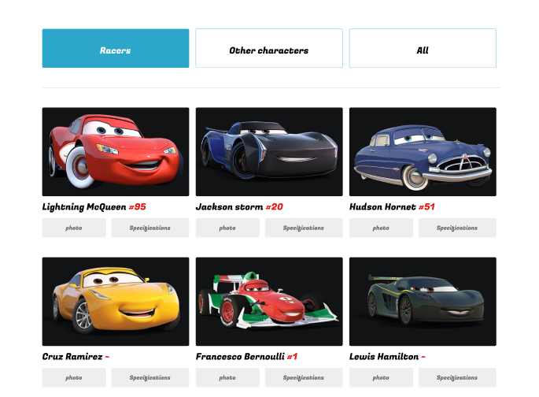

# Cars. Fun Site

## Обзор проекта
Проект представляет собой полностью адаптивный сайт-каталог, ориентированный на демонстрацию различных транспортных средств из вселенной «Тачки». Веб-сайт будет иметь интерфейс администратора для управления записями каталога, включая возможность добавлять, редактировать и удалять транспортные средства, а также связанные с ними данные, такие как имя, фотография и описание. 

Кроме того, веб-сайт сжимает большие фотографии во время процесса загрузки и поддерживает динамическое добавление изображений-слайдеров для каждого автомобиля. Стек технологий включает Flask в качестве серверной платформы, MongoDB в качестве основной базы данных и Docker для простого развертывания.



---

### Backend
1. Фреймворк: Flask
2. База данных: MongoDB 
3. Контейнеризация: Docker

### Frontend
1. jQuery.
2. SCSS.
3. БЭМ-нотация.
4. Библиотеки JS: различные небольшие библиотеки JS для определенных функций, таких как раскрывающиеся меню и ползунки.
5. Оптимизация: Ленивая загрузка изображений и динамическая загрузка с помощью кнопки «Загрузить еще».

---

## Бэкэнд-эндпойнты

### 1. Аутентификация

POST; URL: `/api/login.`
Тело запроса:
```json
{"username": "root", "password": "password"}
```

### 2. Получение списка машин
