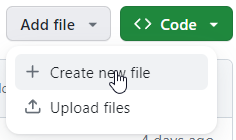
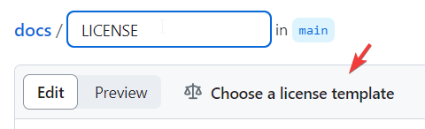
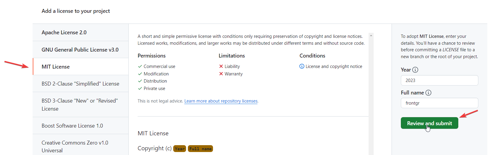

# Пример-шаблон README

README пишутся коротко, по сути, на английском. За основу README брать [README FUNHAUS-a](https://github.com/frontgr/funhaus/blob/main/README.md).

---

<Название проекта>

Короткое описание проекта. Тут должна быть ссылка на [деплой](https://frontgr.github.io/funhaus/).

## Preview of the project

Тут должен быть скриншот(ы) проекта и ссылка на макет, если есть, [например так.](https://www.figma.com/file/VYw8ju5ToInkoS4C4XaQ2R/Fun-Haus-v1.0?type=design&node-id=0%3A1&mode=design&t=Hh5f9Jmwv0K7C4p7-1).

---

### Technologies Used

Тут идет нумерованный список технологий, которые используются, например:

1. BEM notation
2. SCSS
3. Docker
4. Vanilia JS

Ниже указываются другие технические особенности, например, что в проекте есть слайдеры, кастомные курсоры и т.п.

---

### Formatting rules

Пишем о том, что в проекте мы используем правила форматирования Prettier, в такой форме:

_We use Prettier for formatting our text. See more about our configuration [here](https://frontgr.github.io/docs/prettierrc/prettierrc/)._

---

### How to run Docker

Указываем, как запустить Docker:

You should clone the repository, install Docker and run this command in the same directory:

```bash
docker-compose up --build
```

You can read more about Docker [here](https://frontgr.github.io/docs/docker/docker/).

---

Указываем, что в проекте есть лицензия:

Project has [MIT License](https://github.com/frontgr/funhaus/blob/main/LICENSE).

## Важно - в каждом проекте нужна лицензия MIT

Добавляем файл:



Пишем в названии LICENSE и нажимаем на _Choose a license template_:



Выбираем слева MIT License, пишем год и имя нашей организации коммитим изменения:



## MD-версия README FUNHAUS

````md
# FUNHAUS

Simple website of architecture company. Deploy you can check [here](https://frontgr.github.io/funhaus/).

## Preview of the project


Link to Figma layout is [here](https://www.figma.com/file/VYw8ju5ToInkoS4C4XaQ2R/Fun-Haus-v1.0?type=design&node-id=0%3A1&mode=design&t=Hh5f9Jmwv0K7C4p7-1).

---

### Technologies Used

1. BEM notation
2. SCSS
3. Docker
4. Vanilia JS

Also FUNHAUS has slider, custom cursor and theme changing.

---

### Formatting rules

We use Prettier for formatting our text. See more about our configuration [here](https://frontgr.github.io/docs/prettierrc/prettierrc/).

---

### How to run Docker

You should clone the repository, install Docker and run this command in the same directory:

    ```bash
    docker-compose up --build
    ```

You can read more about Docker [here](https://frontgr.github.io/docs/docker/docker/).

---

Project has [MIT License](https://github.com/frontgr/funhaus/blob/main/LICENSE).
````
