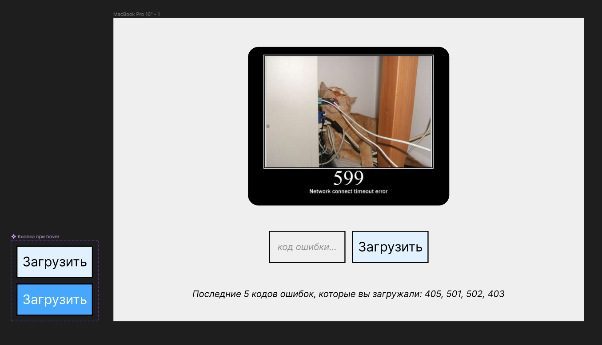
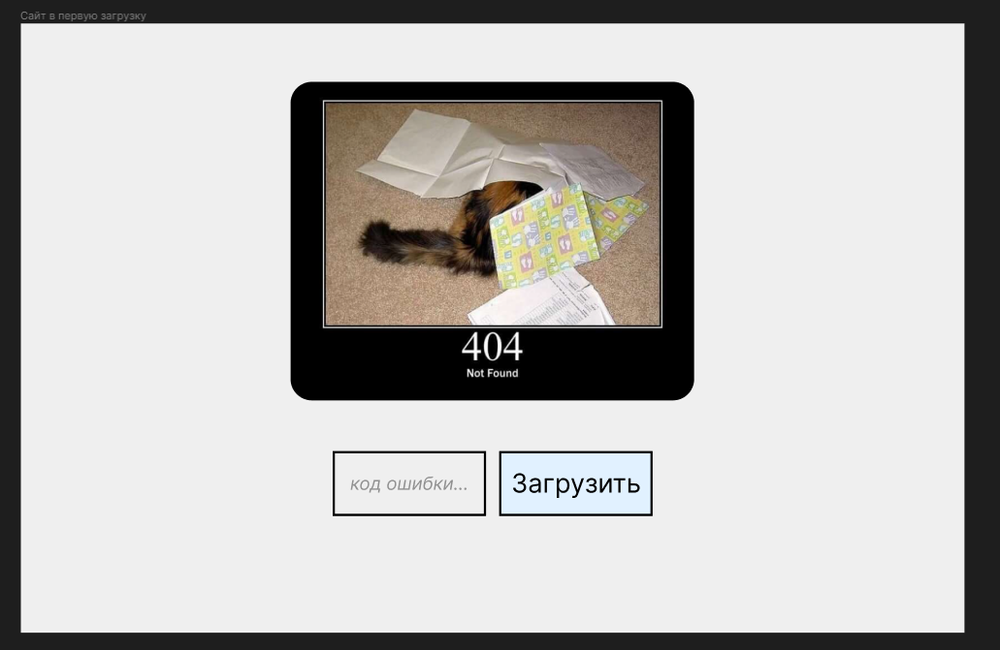

# Техническое задание на работу с чистым JS

## Общие требования

**Цель задания проекта:** Написать на чистом JS (можно с ванильными библиотеками, по типу JQuery) простое веб-приложение с [httpcats](https://http.cat/). _Что такое HTTP cats?_ Это набор запросов, которые возвращают на коды ошибок веселые фотки котов по GET-запросу.

Например, по запросу `https://http.cat/599` будет возвращена [вот такая](https://http.cat/599) картинка.

**Результат ТЗ:** Ссылка на деплой веб-приложения (Gh pages/Vercel) и на репозитория Github. 

## Технологии

1. Простейшая верстка HTML/CSS по [макету](https://www.figma.com/file/ons9r5MEmXXuXAMdXFwmrI/%D0%A2%D0%B5%D1%81%D1%82%D0%BE%D0%B2%D0%BE%D0%B5-%D0%B7%D0%B0%D0%B4%D0%B0%D0%BD%D0%B8%D0%B5---JS-App?type=design&node-id=0%3A1&mode=design&t=Ea7NEI8MSMOE3Lll-1)
2. Использование localstorage
3. Использование fetch
4. Модифицирование DOM

## Макет и точное описание работы приложения

Сссылка на макет вот [тут](https://www.figma.com/file/ons9r5MEmXXuXAMdXFwmrI/%D0%A2%D0%B5%D1%81%D1%82%D0%BE%D0%B2%D0%BE%D0%B5-%D0%B7%D0%B0%D0%B4%D0%B0%D0%BD%D0%B8%D0%B5---JS-App?type=design&node-id=0%3A1&mode=design&t=Ea7NEI8MSMOE3Lll-1). 

В веб-приложении можно и нужно: 

1. Ввести код и по Enter или по нажатию на кнопку загрузить с httpcats картинку.

2. Последние 5 или меньше кодов ошибок показывать внизу под кнопками в строчке '_Последние 5 кодов ошибок, которые вы загружали: 405, 501, 502, 403_'. Если пользователь впервые на сайте, не показывать эту строчку. 

3. Сохранять последние 5 кодов в localstorage и после перезагрузки показывать их на странице в строчке и отрисовывать фото кота с последним кодом, который был введен. 

4. Если пользователь впервые зашел на сайт, то загружается картинка с кодом 404. 

Как выглядит сайт после первой загрузки без информации о введенных ранее кодах. 