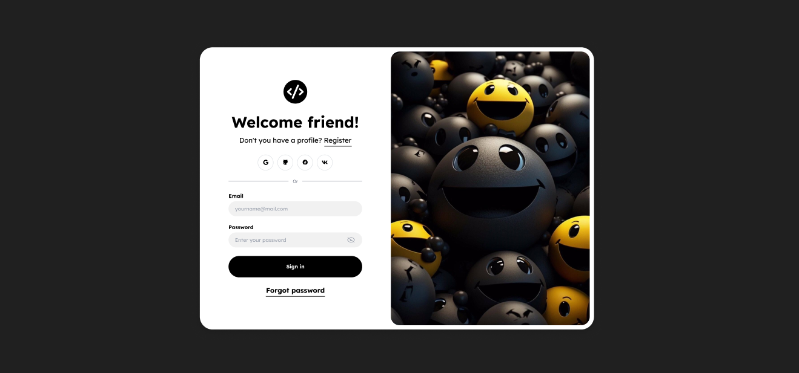

# Тестовое задание по верстке: Создание карточки блога

### Описание задачи
Сверстать макет карточки блога, предоставленный в Figma, используя SCSS для стилизации и чистый HTML. Выполнить деплой верстки на GH pages или на Vercel, по желанию. 

[Макет карточки блога в Figma.](https://www.figma.com/file/ZvEVdWwZcA5mwfdBxpJ54J/Untitled?type=design&node-id=1%3A5&mode=design&t=8thkKNYgcpxwC2wf-1)

### **Результат работы**
Ссылка на деплой верстки на **GitHub pages** или на **Vercel**. Инструкции о том, как это сделать, можно найти в сети. 

### Инструкции
1. Используйте [предоставленный макет Figma](https://www.figma.com/file/ZvEVdWwZcA5mwfdBxpJ54J/Untitled?type=design&node-id=1%3A5&mode=design&t=8thkKNYgcpxwC2wf-1)
 для верстки карточки блога.
2. Используйте SCSS для стилизации.
3. Разметка должна быть выполнена с помощью чистого HTML.

### Требования к верстке
1. Разместить элементы карточки (заголовок, изображение, описание, кнопка) согласно предоставленному макету.
2. Использовать семантическую разметку HTML для лучшей доступности и SEO-оптимизации.
3. Поддержка различных разрешений экранов (от мобильных устройств до десктопов) должна быть учтена с помощью медиа-запросов.
4. Адаптивность: карточка должна корректно отображаться на различных устройствах и экранах.
5. Использовать переменные SCSS для цветов, шрифтов и других повторяющихся значений.
6. Код должен быть чистым, хорошо структурированным.
7. Использовать flexbox или grid для создания адаптивной сетки.
8. Карточка находится ровно по центру, всегда. 
