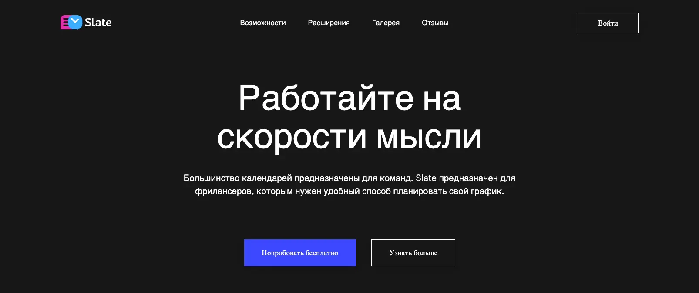
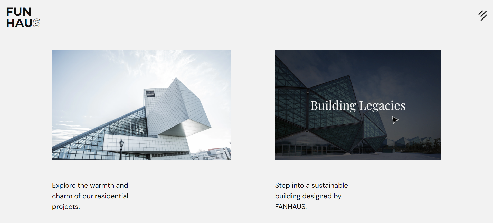
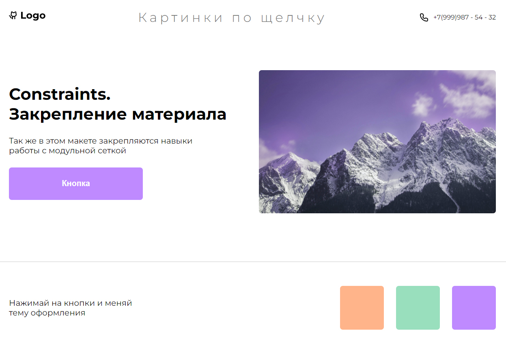

# Техническое задание - ручное тестирование Frontend

## Общие требования

Цель работы:

Протестировать 3 сайта, имея на руках макеты, pixelperfect проверка не требуется.

Результат работы: Отчет о найденных дефектах в формате:

- Баг
  - Описание бага
- Шаги для воспроизведения
- Ожидаемый результат
- Фактический результат
- По возможности скриншот дефекта и/или видео

---

## Список сайтов для тестирования

### Slate

[Ссылка на макет](https://www.figma.com/file/pPwbl0gxRex1fTmgcOZQMi/Slate?type=design&node-id=0-3519&mode=design&t=yH2GxxgJ7uSbbRV4-0), [ссылка на сайт](https://slate-8ohg.vercel.app/).

### FUNHAUS

[Ссылка на макет](https://www.figma.com/file/VYw8ju5ToInkoS4C4XaQ2R/Fun-Haus-v1.0?type=design&node-id=0%3A1&mode=design&t=Hh5f9Jmwv0K7C4p7-1), [ссылка на сайт](https://frontgr.github.io/funhaus/).

### Pics-on-click

[Ссылка на макет](https://www.figma.com/file/P4nYNKO5xOtYrKl5RYx4pW/%D0%9A%D0%B0%D1%80%D1%82%D0%B8%D0%BD%D0%BA%D0%B8-%D0%BF%D0%BE-%D1%89%D0%B5%D0%BB%D1%87%D0%BA%D1%83?type=design&node-id=0%3A1&mode=design&t=W7pkAKrebnB8Sy9B-1), [ссылка на сайт](https://frontgr.github.io/pics-on-click/).
