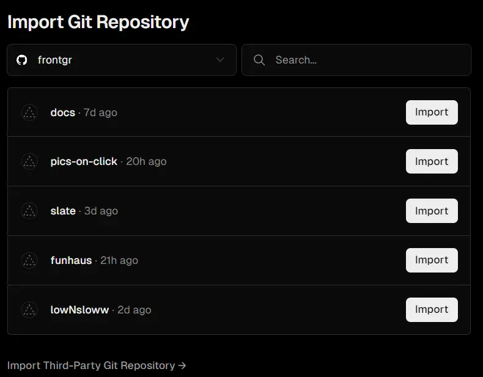

# Деплой для фронтенда

Деплоить фронтендер можно на Vercel или на GH Pages.

Оба сервисы деплоя относительно простые, вот два видео про них:

## Vercel

[Подробное видео](https://youtu.be/3bN1TC_qI0E?feature=shared).

Пример импортирования с Github:

## Github pages

[Подробное видео](https://youtu.be/QyFcl_Fba-k?si=_2sjDZEmFRNOutpS)
