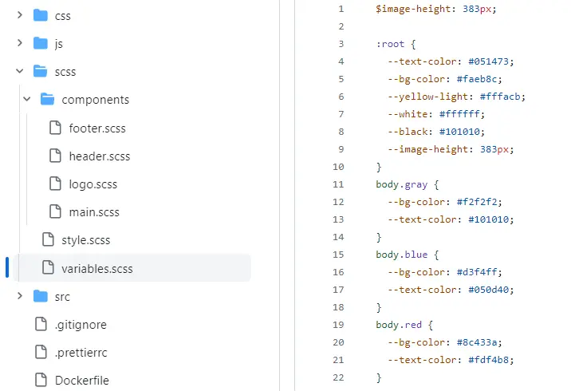

# SCSS

Все проекты должны использовать SCSS. Документация по этому препроцессору [тут](https://sass-lang.com/documentation/syntax/).

[Подробное видео про SCSS](https://youtu.be/gooOJGDfmt4?si=3qx6Qhhm3uhhAhfs).

Пример структуры SCSS в [FUNHAUS](https://github.com/frontgr/funhaus/blob/main/scss/variables.scss):

